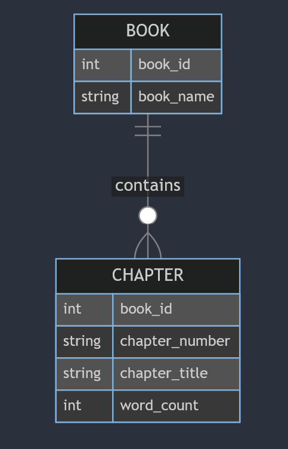
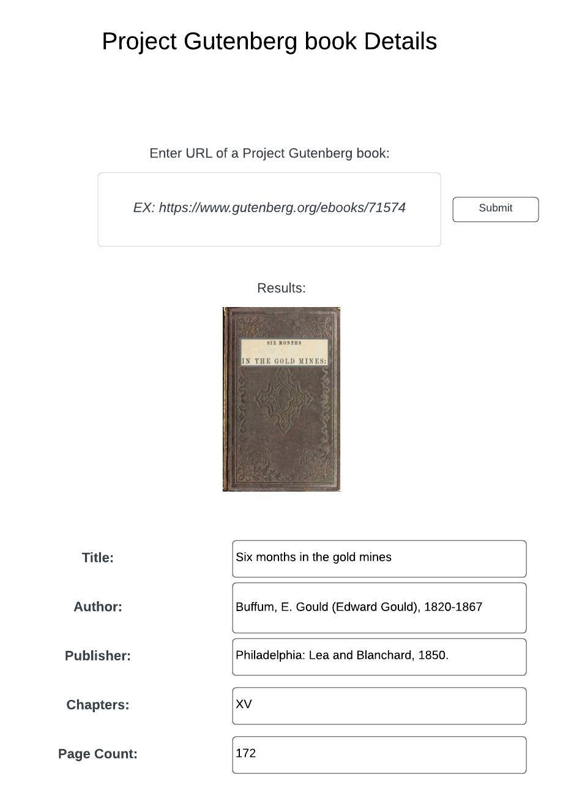

Project Gutenberg
=================

This project will extract textual data from a project gutenberg book.

## Data source

[Six months in the gold mines by E. Gould Buffum](https://www.gutenberg.org/ebooks/71574)

## Items of interest
* thumbnail
* title
* author
* publisher
## Data Table Items of interest
* chapters
* page count

---
ER Diagram
---

## Proposed layout

